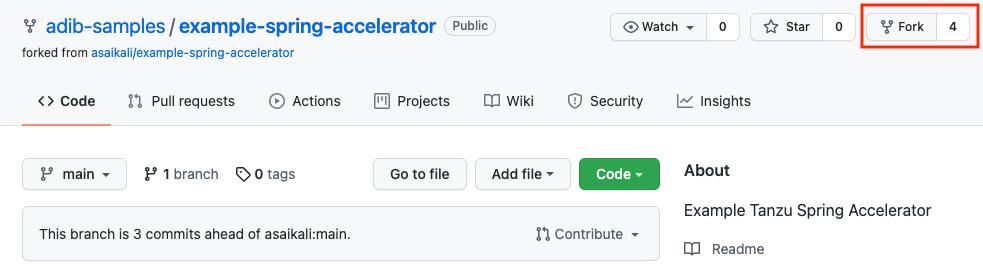
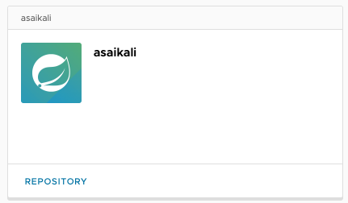
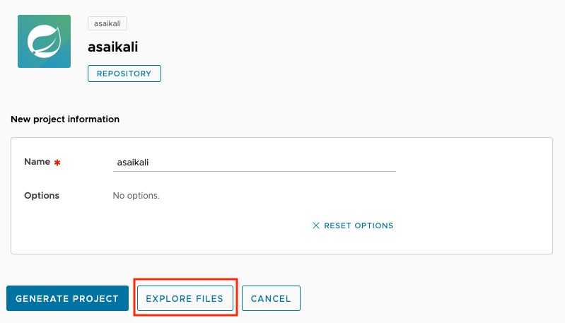

## Register an accelerator 

You will need a github account to complete this step. 

### Fork the sample code repo 

Open the repo below and fork it into your personal Github account

```dashboard:open-url
url: https://github.com/adib-samples/example-spring-accelerator
```



Clone the git repo you have just created by forking

``` execute 
git clone url-to-your-cloned-repo
```

## Define Accelerator CRD file 

Create a placeholder for the accelerator CRD file, e.g. `example-spring-accelerator/reg.yaml`

```execute 
touch example-spring-accelerator/reg.yaml
```

Open the accelerator CRD file

```editor:open-file
file: example-spring-accelerator/reg.yaml
```

Copy and paste the YAML content below into the `example-spring-accelerator/reg.yaml` file 

```copy
apiVersion: accelerator.apps.tanzu.vmware.com/v1alpha1
kind: Accelerator
metadata:
  name: change-accelerator-name-here
spec:
  git:
    url: https://github.com/change-github-id-here/example-spring-accelerator
    interval: 10s
    ref:
      branch: main
```

### Update the YAML file

Update the name of the accelerator to be the same as your github id, for 
example my github user id is `asaikali` so the Accelerator name will be 
`asaikali` on the line 4.

Similarly, set the url to point to the git repo you forked earlier on line 7,
e.g. https://github.com/asaikali/example-spring-accelerator


# Register the accelerator 

Submit the CRD to the PoC Kubernetes cluster 

```execute
kubectl apply -f example-spring-accelerator/reg.yaml
```

You should see output similar to the one below 
```text
accelerator.accelerator.apps.tanzu.vmware.com/asaikali created
```

Get the list of all accelerators 
```execute 
kubectl get accelerators 
```

You should see your accelerator in output. For example the output 
below shows the `asaikali` accelerator.

```text
NAME                         READY   REASON   AGE
asaikali                     True             88s
example-spring-accelerator   True             21d
hello-fun                    True             27d
hello-ytt                    True             27d
node-express                 True             27d
spring-petclinic             True             27d
spring-sql-jpa               True             27d
tanzu-dotnet-webapi          True             23d
tanzu-java-web-app           True             27d
weatherforecast-csharp       True             27d
weatherforecast-fsharp       True             27d
weatherforecast-steeltoe     True             27d
```

## Explore your new Accelerator

Open the Accelerator Portal and you should be able to see your accelerator 
listed in the list of avilable accelerator.

```dashboard:open-url
url: http://20.42.34.233/dashboard/
```



Once you click on your accelerator, try the "EXPLORE FILES" button.



Also, you can click "GENERATE PROJECT" button to download a project.
Notice that the downloaded zip file matches the accelerator name.

In the next step, we will add options to accelerator by creating an 
`accelerator.yaml` file with metadata that will be used by the Accelerator Portal.

