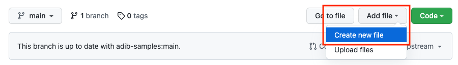
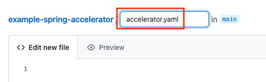
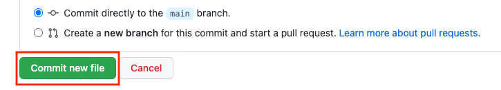

## Define Accelerator YAML

The Application Accelerator looks for a file called `accelerator.yaml` at the root
of the git repo that was referenced from the `reg.yaml` you created in the previous
step.

The file `accelerator.yaml` defines all the options that can be set on the accelerator
along with transformation rules to apply to the git repo that is source of the accelerator.

In order to avoid having to log into your Github account from the integrated terminal,
and possibly expose your Github credentials, we recommend following the steps directly
in the Github.com Web UI of the repo you forked in the earlier steps.

### Create the Accelerator file 

Create a file at the root of the repo



Call it `accelerator.yaml`



Commit the empty file. 



### Define metadata for the accelerator 

Copy and paste the content below into the `accelerator.yaml` file using 
the Github.com UI and set the display name to Github userid. 

```copy-and-edit
accelerator:
  displayName: change-the-display-name
  description: An example starting template for a spring web app
  iconUrl: https://raw.githubusercontent.com/sample-accelerators/icons/master/icon-cloud.png
  tags:
    - Java
    - Spring
    - Web
    - JPA
    - Test Patterns
```

Commit the changes on the Github UI. 

Refresh the accelerator dashboard

```dashboard:open-url
url: http://20.42.34.233/dashboard/
```

Your accelerator should now have a description and tags as defined above.
Try finding your accelerator using the tags that you registered under in the `accelerator.yaml` file. 

### Configure options for the Java JDK to use 

The `options` section of the `accelerator.yaml` is used to define a UI form
that will be used to prompt users for inputs to use when using 
the accelerator. The vaule of each option is made avilable inside a
variable that can be referenced from the transformation section 

Copy and paste code snippet below into the `accelerator.yaml` and commit the changes.

```copy
  options:
    - name: javaVersion
      inputType: select
      dataType: string
      display: true
      required: true
      defaultValue: "11"
      choices:
        - text: 11 (Supported in Production)
          value: "11"
        - text: 17 (Production in Oct 2022, QA only for now)
          value: "17"
```

Notice the indentation, the `options` should be
at the same level as `tags` in the YAML file.

After commiting the changes, wait 10 seconds and refresh the
accelerator portal to see new drop down option in the UI. If you 
get an error message check that the YAML is formatted correctly.

### Configure option for removing database support 

Add a toggle button for turning off the database support, by copying
and pasting the code snippet below into `accelerator.yaml` under
the options key.

```copy
    - name: noDB
      label: Stateless (Don't need a database)
      inputType: toggle
      display: false
      dataType: boolean
      defaultValue: false
```

Notice the indentation again, the `name: noDB` should be
at the same level as `name: javaVersion` in the YAML file.

After commiting the changes, wait 10 seconds and refresh the
accelerator portal to see new drop down option in the UI. If you 
get an error message check that the YAML is formatted correctly.

### Configure option for enabling Sonar Qube 

Lets add an option to configure the generated project to use 
sonarqube for static code analysis. We have two UI elements that 
we want to show, the first element is a toggle button that 
enables sonarquibe, the second is an edit box that is used to 
set the name of the sonarqube project that analysis results 
shoud be sent to. The ability to configure conditional UI 
elements is one of the nice features of Application Accelerator.

Copy and paste the code snippet below into the `accelerator.yaml`
under the options key. 

```copy 
    - name: sonar
      label: use sonarqube
      inputType: toggle
      display: true
      dataType: boolean
      defaultValue: false
    - name: projectKey
      label: Sonar project key
      dataType: string
      defaultValue: ''
      dependsOn:
        name: sonar
```

After commiting the changes, wait 10 seconds and refresh the
accelerator portal to see new drop down option in the UI. If you 
get an error message check that the YAML is formatted correctly.

### Summary 

In the `accelerator.yaml` we were able to define metadata 
about the accelerator so that it can be displayed by the portal.
We were also able to define a user interface to collect input
from the user and bind the input to variables in the next 
seciton we will configure transformations that will use the 
inputs collected by the UI to change the output of the 
accelerator. 

